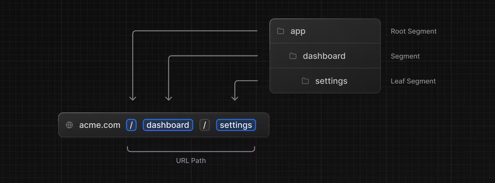
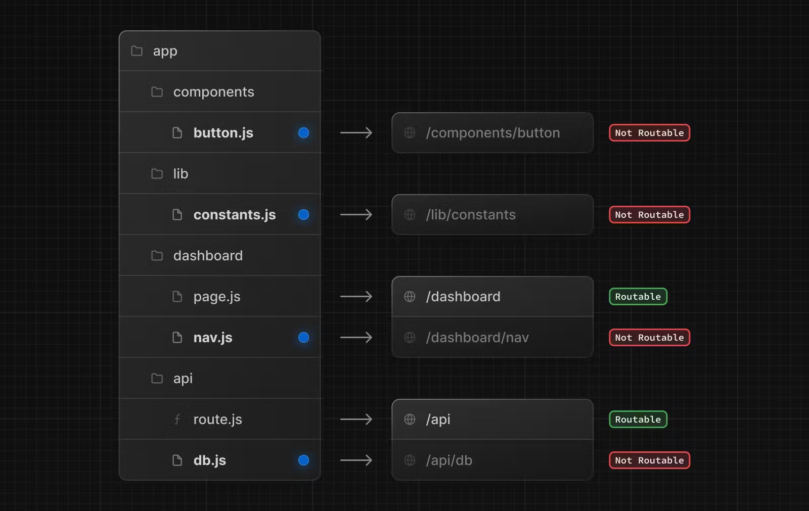
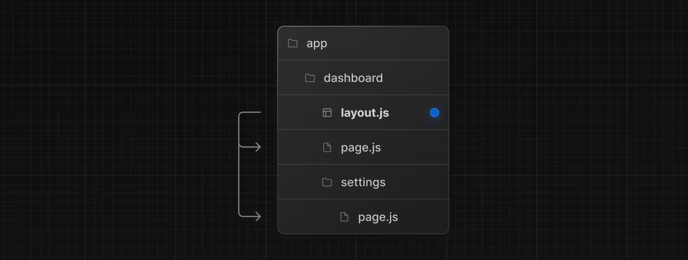

# Next.js and React
## Version for Next.js: 14.2.3
## Components
- As convention React components start with capital letter.
- Every component in React is a function that returns some HTML.
- React components can be used as any HTML tag.
  
``` JavaScript
function Header() {
  return <h1>Develop. Preview. Ship.</h1>;
}
 
const root = ReactDOM.createRoot(app);
root.render(<Header />);
```
- Components can be nested inside each other. Simply use the component as a **tag** inside the HTML of another component.

### Displaying data with props
- As in regular HTML, you can pass arguments/props (like `src= something`) to the React Components.

**To pass props:**
```JavaScript
function HomePage() {
  return (
    <div>
      <Header title="React" />
    </div>
  );
}
```

**To access the prop:**
The prop is passed as key-value pair (like a hashmap). To select a value we use `pros.value_name` for example: `props.title`.
```JavaScript
function Header(props) {
  console.log(props); // { title: "React" }
  return <h1>Develop. Preview. Ship.</h1>;
}
```


**Object destructuring:**
You can use object destructuring to explicitly name the values of props inside your function parameters.
```JavaScript
function Header({ title }) {
  console.log(title); // "React"
  return <h1>{title}</h1>; 
}
```
- To use variables (and their values) inside `.tsx` return value we need to wrap them in `{}` like above. 
- For example:
  - `return <h1>{title}</h1>;` displays the **content of the variable** named title.
  - `return <h1>title</h1>; ` displays the **word 'title'**.

**Good to know:** By using `{}` we can embed ANY piece of code inside some HTML. That code will be executed when displaying that piece of HTML.

**Returning string literals:**
To return a string literal inside some HTML we need to wrap it in `{}`. We can also use f-strings to embed variable values.
```JavaScript
function Header({ title }) {
  return <h1>{`Cool ${title}`}</h1>;
}
```

### Iterating through lists
```JavaScript
function HomePage() {
  const names = ['Ada Lovelace', 'Grace Hopper', 'Margaret Hamilton'];
 
  return (
    <div>
      <Header title="Develop. Preview. Ship." />
      <ul>
        {names.map((name) => (
          <li key={name}>{name}</li> // You need a key to uniquely identify each HTML element
        ))}
      </ul>
    </div>
  );
}
```
### Adding Interactivity with State
- To add interactivity we can specify method names in `{}` as arguments for parameters like `onClick`.
```JavaScript
function HomePage() {
  // ...
 
  function handleClick() {
    console.log("increment like count")
  }
 
  return (
    <div>
      {/* ... */}
	  <button onClick={handleClick}>Like</button> // Whenever we click the button the 
                                                  // handleClick function is called
    </div>
     )
   }
```
### State
- To keep state (for example to keep the value of an input, or to save if a button was pressed, or switch) we use `useState()`.
  - `useState()` returns an array. You can extract its values with **array destructuring** as following: `const [] = useState();`.
  
- The first item in the array is the state `value`, which you can name anything. We can access the state through this `value` variable. Simply use it as a usual variable.
- The second item in the array is a function to `update` the value. You can name the update function anything, but it's common to prefix it with `set` followed by the name of the state variable you're updating: 
```JavaScript
const [likes, setLikes] = React.useState();
```
- To use `set` simply call `setValue(desired_value)` (`setValue` is just a placeholder name here, it can be anything)and this will set the `value` to the `desired_value`.
- You can also add an initial value to the state
```JavaScript
useState(_default_value);
```
**Note:** Unlike props which are passed to components as the first function parameter, the state is initiated and stored within a component. You can pass the state information to children components as props, but the logic for updating the state should be kept within the component where state was initially created.

**ATTENTION:** The `useState` instruction must be done inside a component.

## Routing
We use `app` routing for the project since it is more modern.
### Directory routing
For the Next.js routing the directory structure itself is used for the routing.



Each directory adds up one more nesting.
The root route `/` is served directly from `app` directory.

**Good to know: `.js`, `.jsx`, or `.tsx` file extensions can be used for special files.** These special file extensions are the ones that serve the content when accessing the websites. 

### Document names have special meanings
- `layout`	Shared UI for a segment and its children
- `page`	Unique UI of a route and make routes publicly accessible
- `route`	Server-side API endpoint

In addition to special files, you have the option to colocate your own files (e.g. components, styles, tests, etc.) inside folders in the `app` directory.

This is because while folders define routes, only the contents returned by `page` or `route` are publicly addressable.


If we access `/api` or `/dashboard` we would be automatically served whatever the `default export function` of `route` returns.
### Page
A page is UI that is unique to a route. You can define a page by default exporting a component from a `page.js` file. 
Each directory (directory -> URL path) that returns something to the web browser should have a `page.js` (`.jsx` `.tsx` also allowed).

For example, to create your `index` page (**your main page**) , add the `page.js` file inside the app directory directly.
``` TypeScript
// `app/page.tsx` is the UI for the `/` URL
export default function Page() {
  return <h1>Hello, Home page!</h1>
}
```
Then to create further pages, create new folders within the `app` directory and add new `page` file to each of them.
```TypeScript
// `app/dashboard/page.tsx` is the UI for the `/dashboard` URL
export default function Page() {
  return <h1>Hello, Dashboard Page!</h1>
}
```
**Good to know**:
- The `.js`, `.jsx`, or `.tsx` file extensions can be used for Pages.
- You can also run natively `.ts` in the Front-end. It can be used for scripts.
- A page is always the **leaf** of the **route subtree**.
- A `page.js` file is required to make a route segment publicly accessible.
- Pages are **Server Components** by default, but can be set to a **Client Component** with the directive `'use client';` -> some components like `onClick` and other event listeners or `on_Action_` are **ONLY** for the Client Side.
- Pages can fetch data.
  
### Layouts
A layout is UI that is **shared** between multiple routes. On navigation, layouts preserve state, remain interactive, and do not re-render. Layouts can also be nested.

You can define a layout by default exporting a React component from a `layout.js` file. The component should accept a `children` prop that will be populated with a child layout (if it exists) or a page during rendering.

For example, the layout will be shared with the `/dashboard` and `/dashboard/settings` pages:


```TypeScript
export default function DashboardLayout({
  children, // will be a page or nested layout
}: {
  children: React.ReactNode
}) {
  return (
    <section>
      {/* Include shared UI here e.g. a header or sidebar */}
      <nav></nav>
 
      {children}
    </section>
  )
}
```
**Root Layout (Required)**
The root layout is defined at the top level of the `app` directory and applies to all routes. This layout is required and must contain `html` and `body` tags, allowing you to modify the initial HTML returned from the server.

Default Layout that must  be at the root of `app`:
```TypeScript
export default function RootLayout({
  children,
}: {
  children: React.ReactNode
}) {
  return (
    <html lang="en">
      <body>
        {/* Layout UI */}
        <main>{children}</main>
      </body>
    </html>
  )
}
```
## Dynamic routing
As convention, to mark a dynamic route (route where can have variables in the URL) we use `[route_name]` directory. Inside the `page.tsx` of the `[route_name]` directory we can access the variable sent to this route by having `{params}:{params:{route_name:Type, param2:Type,...}}` as parameter to the function and calling `params.route_name` to retrieve the value inside the default exported function of the `page.tsx`. Basically `[route_name]` is a placeholder for the value sent in the URL.

## Memorizing Values
These techniques help in mitigated rendering React multiple times for state updates that do not actually change the state (For example when changing the form and the same input is given).
### Callback
- Using `useCallback(_func_,[state_variables])` we can prevent calling this `_func_` multiple times if the `state_variables` do not change.  `_func_` is only called if one of the variables changes.
- `useCallback` returns the memoized callback function itself

### Ref
- `useRef(_init_val)` returns a mutable reference variable.
- Should **NOT** be used during render.

### Memo
- `memo(_func_)` is used to memoize a React component.
- `useMemo` returns the memoized value itself.

## Image Optimization
- The framework for this is called `sharp`. To install it run:
```sh
npm i sharp
```
- You can import images directly using `import imageName from 'relative_path_from_current_file';`
- This will return the image itself with the name `imageName` which can be further used in `src=` or uploaded.
